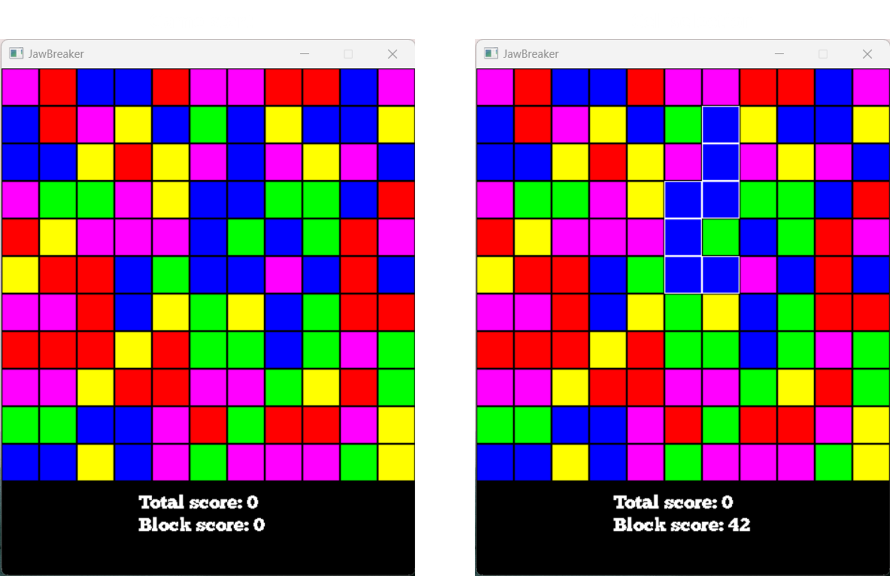
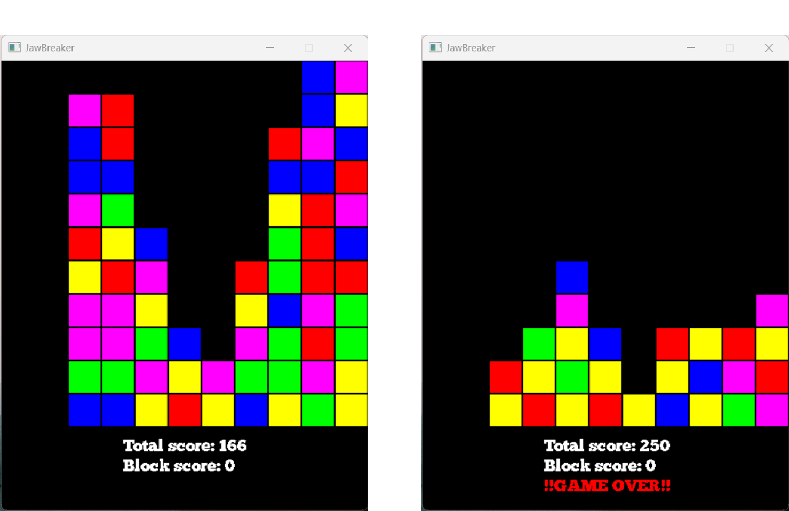
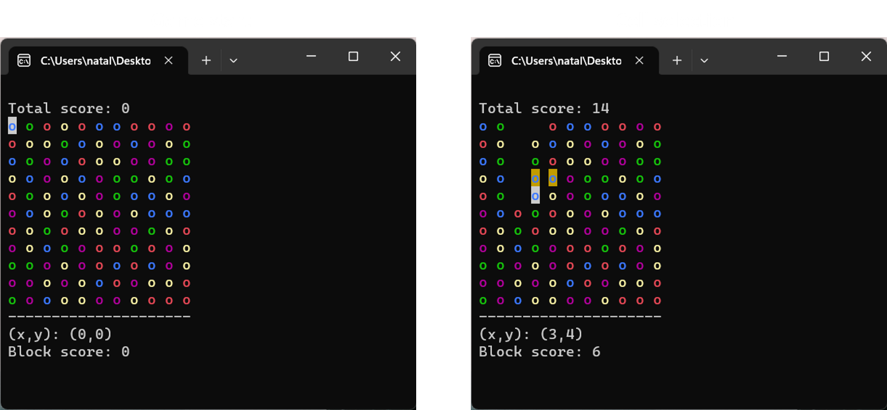
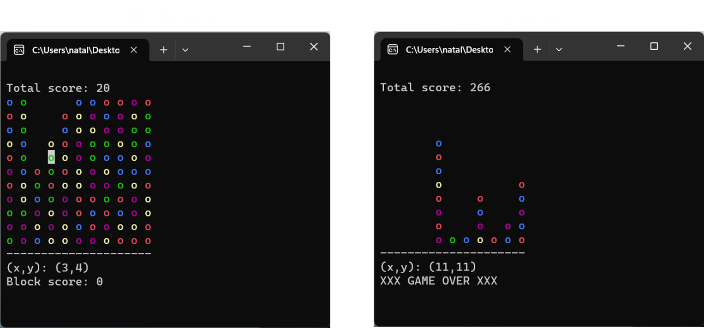

# JawBreaker

**Jaw Breaker game based on C++ in two variants. As window app using SDL 2 and console app.**

## Window app

Use mouse button to select and delete the cells.

## Console

Use 'WSAD' to navigate and 'F' to select and delete the cells.
Use Enter button to chose the option.

